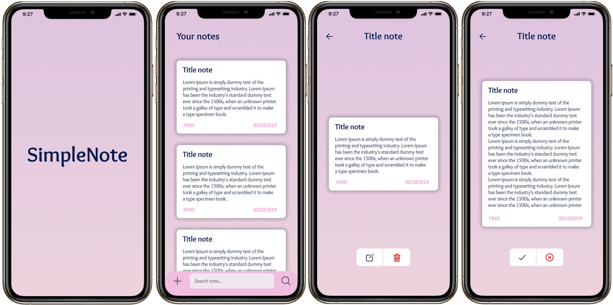

<h1 align="center">
  
</h1>

<h5 align="center">SimpleNote is a note app project, to improve and lear react native practices</h5>

 

<h2 align="center">
 
</h2>

 

# :rocket: Techs

* [React Native](https://reactnative.dev/)
* [Expo](https://expo.io/)
* [AsyncStorage](https://reactnative.dev/docs/asyncstorage)
* [React-Navigation/Stack](https://reactnavigation.org/docs/stack-navigator/)

 

# :computer: How to run

The project is still being developed...
